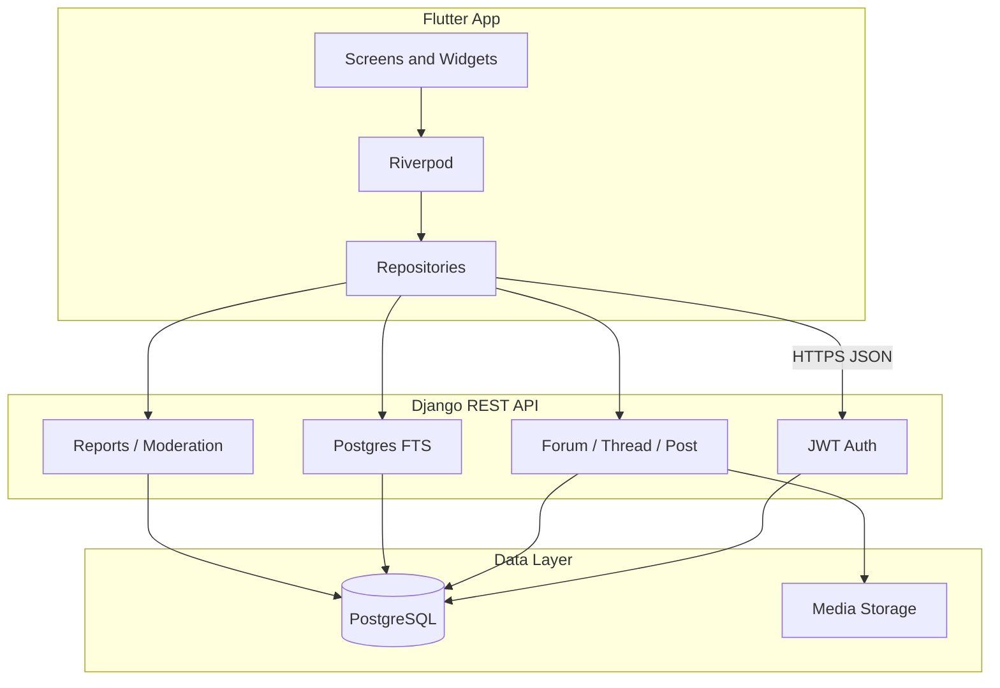

# Lilmod Ulilamed — MVP Plan

> Flutter client + Django/DRF/Postgres backend. Ship a **testable forum first**, then expand based on real usage.

The full feature inventory lives in [`PLAN.md`](PLAN.md). This document defines what actually ships in the MVP.

---

## What the MVP must prove

The MVP only needs to validate this loop:

> A member finds a Torah discussion, contributes something useful, receives a response, and returns to continue the conversation.

Everything in scope serves that loop. Everything else waits.

---

## Product shape

A modern Torah community forum — not a bulletin-board clone and not a multi-product platform on day one.

**Hierarchy:**

```text
Community → Category → optional Subcategory → Thread → flat chronological Replies
```

- One level of subcategories only.
- Tags on threads for flexible filtering.
- Long-form essays are **threads in a category**, not a separate article system.
- Flat replies with optional quote references — no Reddit-style nested comments.

---

## Navigation

### Mobile (primary)

Four bottom tabs:

1. **Forums**
2. **Search**
3. **Members**
4. **Profile**

Plus:

- **Create Thread** — prominent FAB or top action
- **Notifications** — bell in app bar with unread badge

### Routes (~13)

```text
/
/login
/register
/forums
/forums/:slug
/threads/:id
/threads/new
/search
/members
/members/:id
/notifications
/bookmarks
/settings
```

Reports open as a **modal or bottom sheet**, not separate routes. Bug reports use the same report flow with `target_type = general`.

---

## Starter categories (6)

Do not launch with 18 empty top-level categories. Start with six; split only when activity justifies it.

| # | Category | Notes |
|---|----------|-------|
| 1 | Beis HaMidrash | General learning and shiur discussion |
| 2 | Halachah and Minhag | Practical halachah questions |
| 3 | Tanach, Parashah, and Jewish Thought | Chumash, Nach, machshavah |
| 4 | Mekoros and Source Finding | Source requests, manuscript questions |
| 5 | Sefarim, Publishing, and Digital Torah | Books, editing, digital tools |
| 6 | Community and Site Discussion | Meta, announcements, feedback |

Use subforums and tags beneath these. Seed 2–4 subforums per category and sample threads so the forum does not look abandoned.

---

## MVP screens

### 1. Home (`/`)

- Recent discussions
- Unanswered questions
- Popular this week
- Create thread CTA
- Small stats (threads, posts, members, online)

No complex sidebars on mobile.

### 2. Forums

- Six category cards (name, description, icon, thread count, last activity)
- Subforum list when drilling into a category
- Thread list with pagination
- Filters: **Latest**, **Unanswered**, **Top** (Following deferred to Release 2)

### 3. Thread

- Opening post + chronological replies
- Quote reply (quoted post stays in main timeline)
- `@mention`
- **Helpful** reaction (single positive signal — no downvotes)
- Bookmark toggle
- Report (modal)
- Reply composer (Markdown)
- Attachments (images, PDFs)
- Thread author or moderator can mark one reply as **Accepted Answer**
- Indicators: pinned, locked, solved, unread
- Pagination or cursor-based lazy loading
- Deep link / scroll to a specific post

### 4. Search

Search across:

- Thread titles
- Post bodies
- Authors (display name, handle)
- Categories and tags

**Release 1:** PostgreSQL full-text search via Django.

Store a **normalized search field** alongside display text for Hebrew content:

- Unicode normalization
- Strip nikkud and cantillation from search copy only
- Normalize punctuation and whitespace
- Preserve original text for display

**Release 3:** OCR indexing for uploaded images (see Deferred).

### 5. Members

- Search by name or handle
- **Top Contributors**
- **New Members**
- **Online Now** (when available)

### 6. Profile

```text
Avatar
Display name
Handle (@username)
Role badge
Short bio
Joined date
Last active
Threads created
Replies posted
Helpful reactions received
Recent posts
```

No popularity scores or five sort modes in MVP.

### 7. Notifications

Three notification types only:

| Type | Trigger |
|------|---------|
| `reply` | Someone replied in a thread you started |
| `quote` | Someone quoted your post |
| `mention` | Someone `@mentioned` you |

**Two delivery layers:**

*In-app (when the app is open):*
- In-app list with unread highlight
- Unread count badge on the bell (poll `unread-count` every 30–60s)
- Mark single or all as read
- Tap → deep link to thread/post

*Push + app-icon badge (when the app is closed):*
- **Firebase Cloud Messaging (FCM)** delivers a push on reply/quote/mention → OS shows a notification **and** paints the red number on the app icon (springboard badge)
- Flutter registers a device token (`firebase_messaging` + `flutter_local_notifications`) and POSTs it to the backend
- Backend stores tokens (`DeviceToken`) and sends FCM messages with a `badge` count = recipient's unread total
- Tapping the push opens the app and deep-links to the post
- **iOS caveat:** app-icon badge requires Apple Developer Program + APNs/push capability; Android works through FCM with no paid account — build/test Android first

No email preferences, batched upvotes, forum-follow alerts, or system announcements in MVP.

### 8. Settings

- Display name
- Avatar upload
- Bio
- Change password
- Dark mode toggle

---

## Bookmarks

Bookmarks are a **silent save-for-later** — they never create notifications.

- Toggle on thread list and thread detail
- List at `/bookmarks`

**Thread follow** (notify on new replies) is deferred to Release 2.

---

## Moderation

- Report post, thread, or member via reusable report sheet
- Report reasons + optional details
- Moderator queue (Django Admin initially; in-app queue optional for MVP)
- Lock / unlock thread
- Pin / unpin thread
- Hide or delete content
- Ban member

Roles: `member`, `moderator`, `admin`.

General bug reports: same `Report` model with `target_type = general`.

---

## Explicitly out of MVP

| Feature | Why deferred | When |
|---------|--------------|------|
| Private messages | Separate product (inbox, spam, blocking, drafts) | Release 4 |
| Article publishing system | Second content model; use forum threads instead | Release 4 |
| Downvotes | Moderation friction | Never unless community asks |
| Rich emoji reactions | Complexity | Release 4 |
| 60-font rich editor | Complexity | Release 3 |
| Forum-follow notifications | Needs follow infrastructure | Release 2 |
| Email notifications | Needs preference system | Release 3 |
| Dedicated report routes (×4) | QA overhead | Use modal |
| 18 top-level categories | Empty forums feel dead | Expand organically |
| Advanced member analytics | Vanity metrics | Release 3+ |
| Algolia / external search | Postgres FTS is enough to start | Release 3 if needed |
| OCR on attachments | Needs real upload volume first | Release 3 |
| Full Hebrew/RTL UI | Support Hebrew *content* in MVP | Release 3 |
| WebSocket real-time | Polling is fine for MVP | Release 3+ |

---

## Architecture



| Decision | Choice |
|----------|--------|
| Backend | Django 5 + DRF + PostgreSQL |
| Auth | JWT (access + refresh) via `djangorestframework-simplejwt` |
| Flutter state | Riverpod + repository pattern |
| HTTP | dio with interceptors |
| Routing | `go_router` |
| Composer | Markdown (Noto fonts for Hebrew) |
| Reactions | Single **Helpful** reaction per user per post |
| In-app notifications | Polling (30–60s) for the in-app bell badge |
| Push notifications | Firebase Cloud Messaging (FCM) → OS notification + app-icon badge count |
| Search (MVP) | PostgreSQL full-text search + Hebrew normalization fields |
| Media | Local filesystem in dev → S3-compatible in prod |
| Admin | Django Admin for users, categories, moderation queue |

Backend lives in **`backend/`** alongside the Flutter app.

---

## Data model (MVP)

```text
User
MemberProfile       display_name, handle, avatar, bio, role, joined_at,
                    last_active_at, thread_count, reply_count,
                    helpful_received_count, is_banned

Category            name, slug, description, icon, display_order,
                    thread_count, last_activity_at

Subforum            category FK, name, slug, description, display_order

Thread              subforum FK, author FK, title, body, normalized_body,
                    tags[], thread_type, status (open/closed),
                    is_pinned, is_locked, is_solved, accepted_post_id,
                    reply_count, view_count, last_activity_at

Post                thread FK, author FK, body, normalized_body,
                    quoted_post_id (nullable), post_number,
                    helpful_count, is_deleted, created_at, edited_at

Attachment          post FK, uploader FK, file, mime_type, file_size,
                    thumbnail (images)

Reaction            post FK, user FK, type=helpful, unique per user/post

Bookmark            user FK, thread FK, unique per user/thread

Notification        recipient FK, actor FK, type (reply/quote/mention),
                    thread FK, post FK, is_read, created_at

DeviceToken         user FK, token, platform (ios/android), created_at,
                    last_seen_at, is_active   # for FCM push + app-icon badge

Report              reporter FK, target_type, target_id, reason,
                    details, status, created_at
```

**Do not add in MVP:** Conversation, PrivateMessage, Article, ArticleComment, ForumFollow, NotificationPreference, Vote (downvote).

**Dropped from the product:** Sponsorship / lineage entirely — no model, no tree UI, no `referred_by` field.

### Counter rules

- Denormalized counters (`reply_count`, `helpful_count`, etc.) updated **server-side only** (signals or service layer).
- Clients cannot edit counts, roles, or moderation fields.

---

## API (`/api/v1/`)

| Area | Endpoints |
|------|-----------|
| Auth | `POST register`, `login`, `refresh`; `GET me`; `POST logout` |
| Home | `GET recent`, `unanswered`, `popular`, `stats` |
| Forums | `GET categories`, `GET subforums/:slug`, `GET threads?subforum=&sort=` |
| Threads | `GET/POST threads`, `GET/PATCH thread/:id`, `GET/POST posts`, `POST accept-answer` |
| Posts | `PATCH/DELETE post/:id`, `POST helpful`, `POST quote-metadata` |
| Search | `GET search?q=&category=&author=&tag=&sort=` |
| Members | `GET members`, `GET members/:id`, `GET members/:id/posts` |
| Bookmarks | `POST toggle`, `GET list` |
| Notifications | `GET list`, `GET unread-count`, `POST mark-read` |
| Push | `POST device-token` (register on login), `DELETE device-token` (on logout) |
| Reports | `POST report` |
| Settings | `PATCH profile`, `POST avatar`, `POST change-password` |
| Attachments | `POST upload` (multipart), linked to post on create |

---

## Flutter structure

```text
lib/
  main.dart
  app.dart
  core/
    config/env.dart
    network/dio_client.dart
    auth/
    router/app_router.dart
    utils/hebrew_normalize.dart
  features/
    auth/
    home/
    forums/
    threads/
    search/
    members/
    profile/
    notifications/
    bookmarks/
    settings/
    moderation/       # report sheet widget
  shared/widgets/
  theme/
```

**Dependencies to add:** `flutter_riverpod`, `dio`, `flutter_markdown`, `file_picker`, `cached_network_image`, `firebase_core`, `firebase_messaging`, `flutter_local_notifications`

**Replace mock data:** Wire all screens through repositories; no fabricated UI state.

---

## Implementation todos

- [ ] **r1-backend-scaffold** — Django/DRF/Postgres in `backend/`, JWT auth, User/MemberProfile, docker-compose, Django Admin
- [ ] **r1-forum-models** — Category, Subforum, Thread, Post, Attachment; seed 6 categories + sample content
- [ ] **r1-api-core** — auth, home, forums, threads/posts CRUD, attachments, basic profiles
- [ ] **r1-flutter-core** — Riverpod, dio, auth flow, go_router (MVP routes), repository layer
- [ ] **r1-flutter-screens** — home, forums, thread detail, new thread, reply, login/register, settings (basic)
- [ ] **r1-search** — Postgres FTS endpoint + Hebrew normalization + search screen
- [ ] **r2-bookmarks** — toggle + bookmarks list
- [ ] **r2-social** — quote, mention parsing, helpful reaction, accepted answer, unanswered filter
- [ ] **r2-notifications** — reply/quote/mention service layer + notification screen + in-app badge polling
- [ ] **r2-push** — FCM setup (Firebase project, Android first), `DeviceToken` model + register/unregister endpoints, server-side push send with app-icon badge count
- [ ] **r2-moderation** — report sheet, lock/pin/hide/delete, admin queue
- [ ] **r3-members** — directory (top/new/online), profile with recent posts
- [ ] **r3-polish** — loading/error/empty states, pagination, responsive layout, dark mode
- [ ] **r3-tests** — backend pytest (auth, CRUD, helpful uniqueness, bookmark silence, report flow); Flutter widget tests for thread card and composer validation

---

## Release sequence

Work in small, reviewable releases. After each release: run tests, list changed files, stop for review.

### Release 1 — Core conversation

- Django scaffold + auth
- 6 categories + subforums + seed data
- Threads and replies (Markdown)
- Attachments
- Flutter API integration
- Basic profiles
- Postgres search

**Exit criteria:** A user can register, browse forums, open a thread, reply, and find content via search.

### Release 2 — Retention

- Bookmarks
- Quote and `@mention`
- Helpful reaction
- Accepted answer + unanswered list
- Reply / quote / mention notifications (in-app)
- Push notifications via FCM + app-icon badge (Android first; iOS once APNs is set up)
- Reports + basic moderation (lock, pin, hide, delete)

**Exit criteria:** A user gets notified — in-app and via a red app-icon badge — when someone responds to them, and can save threads for later.

### Release 3 — Community expansion

- Members directory (top contributors, new, online)
- Improved profiles with recent activity
- Thread following + follow notifications
- Email notifications (basic)
- OCR on image attachments (Cloud Vision) + search indexing
- Hebrew content polish + RTL UI improvements
- Richer Markdown editor options

**Exit criteria:** The forum feels alive; source images become searchable.

### Release 4 — Optional social features

- Private messages
- Dedicated article editorial workflow
- Advanced notification preferences
- Rich Torah emoji reactions
- Algolia (if Postgres search hits limits)
- Forum UI polish (Cascade/List views, personal zone pages)

Only build Release 4 features that real usage demonstrates are needed.

---

## Thread types (MVP)

Keep the enum small:

| Type | Use |
|------|-----|
| `discussion` | Default |
| `question` | Shows in Unanswered until accepted answer |
| `announcement` | Moderator-only creation |
| `mekor_request` | Source-finding requests; also appears in Unanswered |

---

## Testing

**Backend (pytest + DRF):**

- Auth register/login/refresh
- Thread and post CRUD with permissions
- Helpful reaction uniqueness
- Bookmarks do not create notifications
- Notification dedupe (reply + quote + mention to same user → one notification)
- Report creation
- Counter integrity (client cannot PATCH counts)
- Search returns normalized Hebrew matches

**Flutter:**

- Widget tests: thread card, reply composer validation, report sheet
- Integration test: login → browse forum → open thread → reply

**Manual QA checklist:**

- [ ] Register and login
- [ ] Browse categories and subforums
- [ ] Create thread with attachment
- [ ] Reply with quote and mention
- [ ] Mark helpful, bookmark, report
- [ ] Accept answer on question thread
- [ ] Search finds Hebrew text with and without nikkud
- [ ] Notification appears and deep-links correctly
- [ ] Moderator can lock/pin/delete
- [ ] Dark mode and mobile layout

---

## Risks

| Risk | Mitigation |
|------|------------|
| Scope creep | This doc is the source of truth; defer list is explicit |
| Empty forum feel | Seed content; only 6 categories |
| Hebrew search quality | Normalized fields from day one; OCR in Release 3 |
| Over-building admin | Django Admin for MVP moderation |
| Fake UI | No buttons without backend wiring |

---

## Relationship to `PLAN.md`

| Document | Purpose |
|----------|---------|
| **MVPPLAN.md** (this file) | What to build and ship first |
| **PLAN.md** | Full product vision, reference inventory, Phase 2+ backlog |

When in doubt, **MVPPLAN.md wins** until the MVP loop is validated with real users.
