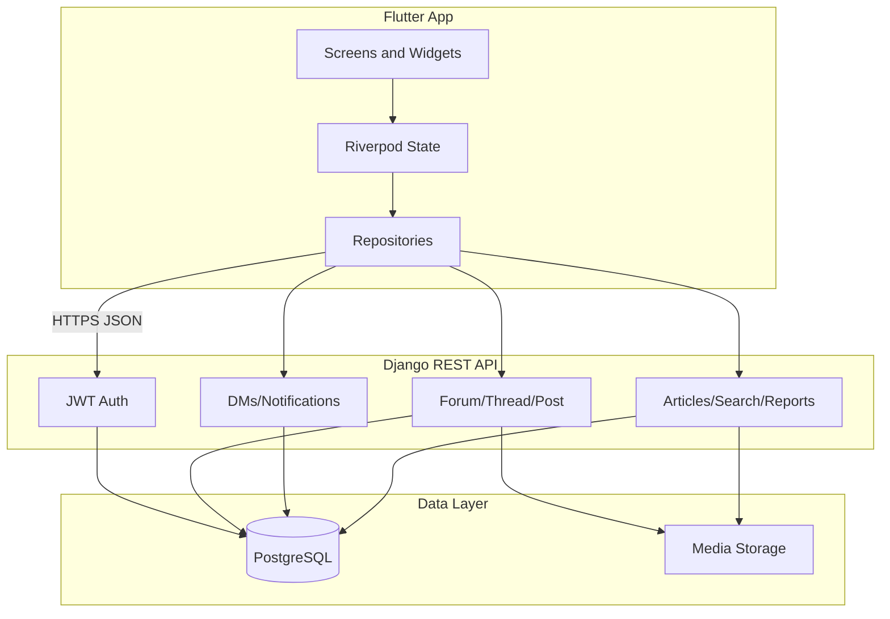

# Lilmod Ulilamed — Full Build Plan

> ⚠️ **SUPERSEDED — historical reference only.** This plan assumed a Django/DRF/Postgres
> backend that was never built, and describes the Flutter app as a "~15–20% UI shell with
> mock data." Neither is true anymore: the app is a working **Supabase**-backed forum with
> real threads/replies/likes/bookmarks/auth and a shipped Seforim reader. For current
> architecture see [`AGENTS.md`](AGENTS.md) / [`CLAUDE.md`](CLAUDE.md); for the Seforim
> feature see [`SEFORIM_PLAN.md`](SEFORIM_PLAN.md). Do not treat anything below as authoritative.

> Flutter client + new Django/DRF/Postgres backend. Phase 1 = **full social** parity with [beingavra.com](https://beingavra.com/). Phase 2 = rich editor, emoji reactions, Hebrew RTL, article submit/review, advanced forum UI.

---

## Overview

Build **Lilmod Ulilamed** as a Torah discourse platform matching Bein Gavra L'Gavra's feature set. The Flutter app at `lib/` is currently a **UI shell (~15–20%)** with mock data only. We will add a new backend in `backend/` and wire all screens to a REST API.

**Phase 1 delivers:** browse + auth + threads/posts + bookmarks + follows + members/profiles + DMs + notifications + settings + topic list views + dedicated report pages.

**Phase 2 defers:** 60-font rich editor, Torah emoji reactions, full Hebrew RTL, article submit/review, Cascade/List forum controls, Unread tab, Watched/Drafts personal zone pages.

---

## Implementation todos

- [ ] **backend-scaffold** — Django/DRF/Postgres in `backend/`, JWT auth, User/MemberProfile, docker-compose
- [ ] **forum-models-seed** — all 18 forum categories + subforums, sample threads/posts/articles
- [ ] **api-v1** — home, forums, threads/posts, articles, search, members, topic lists, bookmarks, votes, follows, reports
- [ ] **social-api** — notifications (reply/quote/mention/upvote/follow/dm) + preferences + FCM push, private messages, settings
- [ ] **flutter-core** — Riverpod, dio, auth flow, expanded go_router, repository layer
- [ ] **flutter-read-screens** — home, forums/subforums, thread detail, articles, search, members, rules
- [ ] **flutter-write-screens** — login/register, new thread, Markdown reply, vote, bookmark toggle
- [ ] **flutter-social-screens** — notifications, DMs, profile (post expand + Quote in DM), settings, topic lists
- [ ] **report-pages** — `/threads/{id}/report/`, `/posts/{id}/report/`, `/users/{id}/report/`, `/report/problem/`
- [ ] **shell-polish** — full nav, user dropdown, bug report upload, loading/error states
- [ ] **tests-qa** — backend API tests, Flutter widget/integration tests, Phase 1 QA checklist

---

## Architecture



| Decision | Choice |
|----------|--------|
| Backend | Django 5 + DRF + Postgres |
| Auth | JWT (access + refresh) via `djangorestframework-simplejwt` |
| Flutter state | Riverpod + repository pattern |
| HTTP | dio with interceptors |
| Phase 1 composer | Markdown (Hebrew via Noto fonts) |
| Phase 1 reactions | Upvote/downvote only |
| Real-time | Polling (30–60s) for notifications |
| Media | Local dev → S3-compatible in prod |

Backend lives in **`backend/`** alongside the Flutter app.

---

## Reference site — full feature inventory

### Global / all pages

**Top banner:**
- `BETA` badge
- `Report bug` → modal: Subject, Page URL (auto-filled), Description, Screenshots (up to 5), Cancel, Send bug report

**Navigation bar:**
- Logo/home link
- `Home`, `Forums`, `Articles`, `Search`, `Members`, `Rules`, `Report problem`
- `עברית` / `EN` locale toggle *(Phase 2)*
- User avatar dropdown: Personal zone, Notifications, Profile, Private messages, Bookmarks, Watched, Log out

---

### Home (`/`)

- Hero: site title, tagline, logo, Forums/Articles/Search buttons
- **Recent discussions:** thread cards with type badge, forum tag, date, post/view counts, bookmark icon, NEW badge, title, latest activity, opened by / latest by
- `Active topics` link
- **Popular topics** sidebar
- **Bookmarks** sidebar — empty state + `Open bookmarks` → `/topics/bookmarked/`
- **Community standards** — 3 bullet points
- **Forum snapshot** — threads, posts, articles, members, online count
- **Source requests** — recent threads with timestamps
- **Featured articles** — category, date, title, description, tags, author, bookmark icon

---

### Forums + topic lists

**Tab bar (shared):** Forums | Recent | Active topics | Popular | Unread | Following | Bookmarked | Unanswered questions

**Forums tab view controls** *(Phase 2):* Cascade/List, Columns 1/2, Box size slider

**18 top-level categories** (each with subforums): Beis HaMidrash, Parashah and Tanach, Halachah and Minhag, Tefillah and Piyyut, Moadim and the Jewish Year, Mekoros and Source-Finding, Sefarim/Publishing/Torah Editing, Dikduk/Lashon/Masorah, Jewish History/Gedolim/Communities, Machshavah/Hashkafah/Mussar, Chinuch and Family, Articles and Long-Form Essays, Community Discussion, Questions/Riddles/Torah Challenges, Technical Help and Digital Torah Tools, Marketplace and Practical Exchange, Community and Site

**Topic list tabs (Phase 1):**

| Route | Description |
|-------|-------------|
| `/topics/bookmarked/` | *"Topics you saved for later. These do not create alerts."* |
| `/topics/following/` | *"Topics and forums you are tracking."* |
| `/topics/unanswered/` | *"Questions and requests still waiting for a good answer."* — Question + Mekor request without satisfactory reply |

**Subforum page (`/forums/{slug}/`):** breadcrumb, title, description, New thread, Follow forum, search within forum, thread list with per-row Follow

---

### Thread view (`/threads/{id}/`)

- Breadcrumb, type label, title, post/view counts, Open/Closed status
- Follow dropdown (In-forum / Email / Both)
- Report → `/threads/{id}/report/`
- Bookmark toggle
- **Per-post:** avatar, username/handle, role badge, join date, post count, `#1` anchor, timestamp, action icons (reply, quote, copy, copy link, quote in DM, report, flag)
- Edited + edit history accordion *(Phase 2)*
- Voting: score, upvote, downvote
- React emoji panel — 5 categories *(Phase 2)*
- **Reply box:** rich text toolbar *(Phase 2 — Markdown in Phase 1)*, attachments, Post reply / Preview / Save draft / Discard

---

### New thread (`/threads/new/`)

- Forum selector, title + formatting toolbar, thread type (Discussion, Question, Mekor request, File request, Article discussion, Poll, Announcement), body, attachments, Open thread / Preview / Save draft

---

### Articles (`/articles/`)

- Submit article button *(Phase 2)*
- Tag filter bar
- 2-column grid cards
- **Article detail:** category, date, title, subtitle, author, body, bookmark, comments section with composer

---

### Submit article (`/articles/submit/`) *(Phase 2)*

- Title, subtitle, category, abstract, tags checkboxes, create new tags, body, attachments, Submit for review / Preview / Save draft / Cancel

---

### Search (`/search/`)

- Text input, Search button, Google button *(Phase 2)*
- Filters: forum, type, author, exact phrase, has attachment
- Results: 3 columns — Threads | Posts | Articles

---

### Members (`/members/`)

- Cards/List toggle, Sort members dropdown
- Collapsed cards: avatar, name, handle, role, online dot, Expand
- Expanded cards: bio, joined, posts, frequency, most active forum, reactions, upvotes, Profile / DM / **more** dropdown → Report this member

**Profile (`/members/{id}/`):**
- Avatar, name, handle, role, Send DM, Report member → `/users/{id}/report/`
- Stats: posts, threads opened, reactions, posts/week, popularity score
- Activity: joined, last active, most active forum/subforum/thread
- Post search + **sort (5 options):** Most recent, Most popular, Most active thread, Oldest, Most viewed
- **Post expand:** text preview + **Quote in DM**

---

### Notifications (`/me/notifications/`)

- Bell icon in nav with **unread count badge** (red dot + number), polled every 30–60s
- List rows: actor avatar, verb-templated text (e.g. *"Avi replied to your thread 'Hilchos Shabbos'"*, *"3 people upvoted your post"*), relative timestamp, unread highlight, tap → deep-links to the target (thread post anchor / message / article / profile)
- Mark all as read, grouped headers by source type, empty state
- Settings → Notifications sub-page maps to NotificationPreference (per-verb in-app + email toggles)

---

### Private messages (`/me/messages/`)

- Search, Filter, Compose
- Tabs: Inbox | Sent | Archived | Trash | Drafts
- List + preview panes
- Labels/folders, blocking *(Phase 2 stub)*

**Compose (`/me/messages/compose/`):** TO/CC/BCC, subject + mini toolbar, body, attachments, Send / Preview / Save draft / Cancel

---

### Settings (`/me/settings/`)

- **Account:** email, username, change password
- **Profile:** display name, real name, credentials, avatar, short line, location, occupation, interests, publications, bio, fixed message ending, language, dark mode, email on watched threads, compact lists
- **Forum layout:** custom grouping checkbox + textarea *(Phase 2)*

---

### Report pages (dedicated, not modals)

| Route | Notes |
|-------|-------|
| `/report/problem/` | Type: Post / Thread / User / General; subject, reason, priority, details |
| `/threads/{id}/report/` | Type pre-set Thread, subject = thread title |
| `/posts/{id}/report/` | *"MODERATION QUEUE — Report Post"* + tagline + **quoted post preview** |
| `/users/{id}/report/` | Type pre-set User, subject = display name. **Not** `/members/{id}/report/` |

---

### Rules (`/rules/`)

- Static rules text (4 paragraphs)

---

## Bookmarks vs. Follows

Two separate systems — do not conflate in models or UI:

| | **Bookmark** (icon toggle) | **Follow** (dropdown) |
|---|---|---|
| Purpose | Save for later, no alerts | Track with notifications |
| Options | Toggle on/off | In-forum / Email / Both |
| List view | `/topics/bookmarked/` | `/topics/following/` |
| Home sidebar | Bookmarks widget | Not shown |
| Creates notification | **No** | **Yes** |

**Fix vs. reference:** Personal zone links Bookmarks to `/me/bookmarks/` (404). Lilmod Ulilamed links to **`/topics/bookmarked/`**.

**Notifications:** Follows are the source of `thread_post` / `forum_thread` notifications. **Bookmarks never create notifications.**

---

## Reference site 404s — do not replicate

| Broken route | Lilmod Ulilamed action |
|---|---|
| `/me/bookmarks/` | Link to `/topics/bookmarked/` |
| `/members/{id}/report/` | Use `/users/{id}/report/` |
| `/me/watched/` | Omit from Phase 1 nav |
| `/me/drafts/` | Defer to Phase 2 |
| `/me/posts/` | Defer to Phase 2 |
| `/login/`, `/register/`, `/invite/` | Auth screens with proper redirects |

---

## Backend — domain model (Phase 1)

- **User / MemberProfile** — display name, handle, avatar, role, bio fields, join date, prefs
- **ForumCategory → Forum → Subforum** — seed all 18 categories
- **Thread** — type enum, status Open/Closed, counts, last activity
- **Post** — thread FK, author, body (Markdown), post number, edited_at
- **Vote** — post FK, user, ±1, unique per user/post
- **Bookmark** — user + thread/article; silent, no notifications
- **ThreadFollow / ForumFollow** — mode in_forum / email / both; creates alerts
- **UnansweredThread** — query: Question/MekorRequest without satisfactory reply
- **Article + ArticleComment**
- **Notification** — `recipient` (User FK), `actor` (User FK, nullable for system), `verb` (enum), generic `target` (thread / post / article / message via type + id), `snippet` (cached preview text), `is_read`, `read_at`, `created_at`. Indexed on `(recipient, is_read, created_at)`
- **NotificationPreference** (per user) — per-verb in-app on/off + email on/off; defaults: replies / mentions / DMs on, upvotes batched
- **DeviceToken** — user FK, FCM token, platform (ios/android), is_active; powers push + app-icon badge
- **PrivateMessage + Conversation**
- **Report / BugReport**

### Notification verbs (Phase 1)

| Verb | Trigger | Actor → Recipient |
|------|---------|-------------------|
| `reply` | new post in a thread you opened | poster → thread opener |
| `quote` | someone quotes your post | poster → quoted author |
| `mention` | `@handle` in a post body | poster → mentioned user |
| `upvote` | your post receives an upvote ("like") | voter → post author (batched/throttled) |
| `thread_post` | new post in a thread you **follow** | poster → thread followers |
| `forum_thread` | new thread in a forum you **follow** | opener → forum followers |
| `dm` | new private message | sender → recipient(s) |
| `article_comment` | comment on your article | commenter → article author |
| `report_update` | your report's status changes | system → reporter |
| `system` | welcome / announcements | system → user |

**Creation rules:**
- **Suppress self-notifications** — never notify a user about their own action.
- **Dedupe per post** — a post that is simultaneously a reply + quote + mention to the same recipient yields **one** notification (priority: mention > quote > reply).
- **Throttle upvotes** — batch into "N people upvoted your post"; only fire on +1 (downvotes never notify).
- Created in a **service/signal layer** on post-create, vote-create, message-create — not inline in views.
- **Push delivery:** each in-app notification also triggers an **FCM push** with an app-icon badge count (see `DeviceToken` model). iOS badge needs APNs/Apple Developer setup; Android via FCM only.

---

## Backend — API (`/api/v1/`)

| Area | Endpoints |
|------|-----------|
| Auth | register, login, refresh, logout, me |
| Home | recent, popular, source requests, stats, online |
| Forums | list, detail, threads by subforum |
| Threads | CRUD, posts, follow, bookmark toggle |
| Topic lists | `/topics/bookmarked/`, `/topics/following/`, `/topics/unanswered/` |
| Posts | CRUD, vote, quote metadata, detail for report preview |
| Articles | list, detail, comments |
| Search | q, forum, type, author, filters |
| Members | list, profile, posts (5 sort options) |
| Messages | conversations, compose, archive/trash |
| Notifications | see dedicated block below |
| Bookmarks | toggle; list via topic endpoint |
| Follows | toggle + mode; list via following endpoint |
| Settings | PATCH account + profile |
| Reports | general, thread, post, user, bug-report |

**Notifications endpoints:**

| Method | Endpoint | Purpose |
|--------|----------|---------|
| GET | `/me/notifications/` | paginated list; `?filter=unread\|all&type=<verb>`; grouped by source type |
| GET | `/me/notifications/unread-count/` | lightweight badge poll (30–60s, matches polling choice) |
| POST | `/me/notifications/mark-read/` | mark all (or `{ids:[...]}`) read |
| POST | `/me/notifications/{id}/read/` | mark single read (on tap / deep-link) |
| GET/PATCH | `/me/settings/notifications/` | read/update NotificationPreference |

---

## Flutter — project structure

```
lib/
  main.dart
  app.dart
  core/
    config/env.dart
    network/dio_client.dart
    auth/
    router/app_router.dart
  features/
    shell/
    home/
    forums/
    topics/          # bookmarked, following, unanswered
    threads/
    articles/
    search/
    members/
    messages/
    notifications/    # NotificationsScreen, Notification model, repo, Riverpod unreadCountProvider (polls unread-count) + FCM device-token registration
    bookmarks/
    settings/
    reports/
    rules/
  shared/widgets/    # migrate existing ContentPanel, ThreadRow, etc. + nav bell-with-badge (in site_header)
  theme/
```

**Key routes (~30):** `/`, `/forums/`, `/forums/{slug}/`, `/topics/bookmarked/`, `/topics/following/`, `/topics/unanswered/`, `/threads/{id}/`, `/threads/new/`, `/threads/{id}/report/`, `/posts/{id}/report/`, `/articles/`, `/articles/{slug}/`, `/search/`, `/members/`, `/members/{id}/`, `/users/{id}/report/`, `/me/notifications/`, `/me/messages/`, `/me/messages/compose/`, `/me/settings/`, `/report/problem/`, `/rules/`

**Dependencies to add:** `flutter_riverpod`, `dio`, `flutter_markdown`, `file_picker`, `cached_network_image`

---

## Implementation sequence

1. Backend scaffold — Django, Postgres, JWT, admin
2. Forum seed — categories, subforums, sample content
3. Flutter core — Riverpod, dio, auth, router, repositories
4. Read path — home, forums, threads, articles, search, members, rules
5. Write path — auth, new thread, reply, vote, bookmark
6. Social path — notification service layer (verbs + dedupe/throttle) + unread-count polling + FCM push, DMs, profile, Quote in DM
7. Moderation — dedicated report pages, bug report upload
8. Topic lists — bookmarked, following, unanswered with shared tab bar
9. Polish — loading/error states, pagination, responsive layout, tests

---

## Phase 2 backlog

- Full rich-text editor (60+ fonts, Hebrew blocks, source boxes, nikkud, speculation/source markers)
- Torah emoji reaction panel (5 categories)
- Hebrew/RTL full UI localization
- Article submit + editorial review
- Forum UI: Cascade/List, columns, box size slider, Unread tab
- Watched topics, Drafts, `/me/posts/`
- Custom forum grouping per user
- WebSocket notifications
- Post edit history, per-post view counts
- PM labels, blocking, full filter panel

---

## Testing

- **Backend:** pytest + DRF tests — auth, thread CRUD, vote uniqueness, bookmark vs follow separation, unanswered filter
- **Flutter:** widget tests for shell/nav; integration test login → thread → reply
- **Manual QA:** checklist against every nav item and Phase 1 screen

---

## Risks

| Risk | Mitigation |
|------|------------|
| Scope creep | Strict Phase 2 defer list; Markdown only in Phase 1 |
| DM parity | Core inbox/sent/compose first; labels/blocking stubbed |
| No reference backend | Model from spec + beingavra HTML structure |
